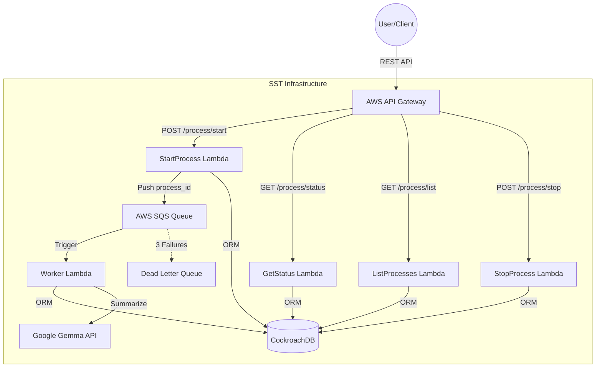
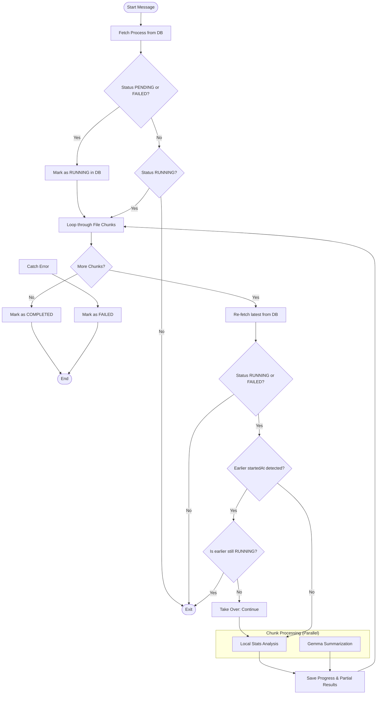

# Document Processing System

## 0. Prerequisites

*   **Node.js:** This project requires **Node.js 24** (as it uses native support for `--experimental-strip-types` and `.env` file loading).

## 1. Technical Architecture (Cloud Native with SST v4)

*   **REST API:** `sst.aws.Api` (AWS API Gateway) to expose the requested REST endpoints.
*   **Asynchronicity:** `sst.aws.Queue` (SQS) to decouple request reception from heavy processing.
*   **Database:** **CockroachDB** (PostgreSQL-compatible) managed with **Sequelize ORM**. Chosen for its serverless architecture, which provides effortless scaling and high availability.
*   **Intelligent Processing:** Integration with **Google Gemma 3** (specifically `gemma-3-27b-it`). Gemma 3 is a family of state-of-the-art open models from Google, chosen for its efficiency in summarization and high-quality multilingual support. It is accessed via the Google GenAI SDK and is available under a generous free tier through Google AI Studio.
*   **Structured Logging:** Implemented using **AWS Lambda Powertools**, providing JSON-formatted logs for better observability and traceability in CloudWatch.

### Infrastructure Diagram


## 2. Module Structure (DDD)

The system's core resides in `src/modules/documentProcessing/`:

```text
./
├── scripts/                # Client TypeScript scripts
│   ├── start_process.ts    # POST /process/start
│   ├── list_processes.ts   # GET /process/list
│   ├── get_status.ts       # GET /process/status/{id}
│   ├── get_results.ts      # GET /process/results/{id}
│   ├── stop_process.ts     # POST /process/stop/{id}
│   ├── test_docs/          # Test documents in English
│   └── test_docs2/         # Test documents in Spanish
├── src/
│   ├── modules/documentProcessing/
│   │   ├── domain/         # Entities and Enums (Process, ProcessStatus)
│   │   ├── repos/          # Repositories (IProcessRepo, ProcessRepo)
│   │   └── useCases/       # Application logic
│   │       ├── startProcess/
│   │       ├── listProcesses/
│   │       ├── getStatus/
│   │       ├── getResults/
│   │       ├── stopProcess/
│   │       └── worker/     # SQS Consumer logic
│   └── shared/
│       ├── core/           # DDD Base Classes
│       └── infra/          # Infrastructure implementations
│           ├── ai/         # AI Adapter (Gemma)
│           ├── iac/        # SST/Pulumi constructs (API, Queue)
│           ├── logger/     # Centralized logging
│           ├── sequelize/  # Database (models, migrations)
│           └── sqs/        # Message Broker implementation
├── sst.config.ts           # SST v4 entry point
└── package.json            # Scripts and dependencies
```

## 3. Processing Flow

1.  **Reception:** The `POST /process/start` endpoint validates files, creates a `PENDING` record in the DB, and sends a message to SQS with the `process_id`.
2.  **Worker:** A Lambda function subscribed to SQS initiates the process:
    *   Changes the state to `RUNNING`.
    *   **Batching:** Reads files in configurable batches.
    *   **Analysis:** For each file, calculates statistics and word frequency.
    *   **AI:** Calls **Google Gemma API** to generate an intelligent summary of the processed document batch.
    *   **Update:** Updates progress and partial results in the DB.
3.  **Finalization:** Upon completion, the state changes to `COMPLETED`. If a fatal error occurs, it changes to `FAILED`.

> **Note on Complexity:** The following diagram reflects the robust logic required to handle distributed systems challenges. Since AWS SQS follows an "at-least-once" delivery model, message duplication is a normal occurrence. The worker implements integrity checks and a "First One Wins" concurrency strategy to ensure that competing instances do not corrupt the process state.

### Worker Logic Diagram


## 4. System States

The system implements the following states to manage the lifecycle of a document processing task:

*   **PENDING**: Process created in the database but not yet picked up by the worker.
*   **RUNNING**: Processing is currently in progress (files are being analyzed).
*   **COMPLETED**: Process finished successfully, and all results are available.
*   **FAILED**: Process terminated due to an error during execution.
*   **STOPPED**: Process was manually stopped by the user via the API.

## 5. API Endpoints Reference

### Process Management
*   **POST `/process/start`**: Initiates a new analysis process. Returns a `process_id`.
*   **POST `/process/stop/{id}`**: Marks a specific process as `STOPPED`. The worker will check this flag before processing the next batch to stop safely.
*   **GET `/process/list`**: Returns a list of all processes and their current states.

### Monitoring & Results
*   **GET `/process/status/{id}`**: Returns the full process object, including real-time `progress` percentage and current `status`.
*   **GET `/process/results/{id}`**: Retrieves the analysis data. Once `COMPLETED`, it returns the full `results` object (word counts, intelligent summary, etc.).

### Response Format Example (`/status/{id}`)
```json
{
  "process_id": "uuid-string",
  "status": "RUNNING",
  "progress": {
    "total_files": 10,
    "processed_files": 3,
    "percentage": 30
  },
  "started_at": "2024-01-15T10:30:00Z",
  "estimated_completion": "2024-01-15T10:32:00Z",
  "results": {
    "total_words": 1500,
    "total_lines": 75,
    "most_frequent_words": ["the", "of", "and", "to", "a"],
    "files_processed": ["doc1.txt", "doc2.txt", "doc3.txt"]
  }
}
```

## 6. Debugging & Testing Hooks

The Worker includes hooks that can be activated via environment variables (e.g., AWS Console) to facilitate testing of edge cases:

*   `TEST_WORKER_DELAY_SECONDS`: Adds a delay (in seconds) after processing each file. Useful for testing the **STOP** functionality.
*   `TEST_WORKER_FORCE_FAILURE`: If set to `true`, the Worker will throw an error during processing to test the **FAILED** state logic.

## 7. Client Scripts

The project includes TypeScript scripts to interact with the API from the terminal. These scripts automatically use the `API_URL` defined in your `.env` file.

### Start a Process
Uploads all `.txt` files from a folder in batches.
```bash
# Process English documents
npm run start-process scripts/test_docs

# Process Spanish documents
npm run start-process scripts/test_docs2
```

### List Processes
Retrieves a list of all processes and their current states.
```bash
npm run list-processes
```

### Check Process Status
Retrieves the current status, progress, and results of a process.
```bash
npm run get-status <process_id>
```

### Get Process Results
Retrieves the full analysis results (only if status is COMPLETED).
```bash
npm run get-results <process_id>
```

### Stop a Process
Manually stops a running process.
```bash
npm run stop-process <process_id>
```

## 8. Automated Tests

The project uses **Vitest** for both unit and end-to-end testing.

### Unit Tests
Focus on domain logic and use cases in isolation using mocks for dependencies (DIP).
```bash
npm run test:unit
```

### End-to-End (E2E) Tests
Validate the full integration (API -> SQS -> Worker -> DB -> AI). These tests require a deployed environment and an updated `.env` file.
```bash
npm run test:e2e
```

## 9. AI Usage Transparency

The following tools and methodologies were employed during development:

1.  **Tools Used:** **Gemini CLI (Google)** was used as the primary AI assistant for code generation, architectural design, debugging, and documentation.
2.  **Modifications:** All AI-generated code was manually reviewed.
**Justification:** Using the Gemini CLI significantly sped up development while keeping code quality high.